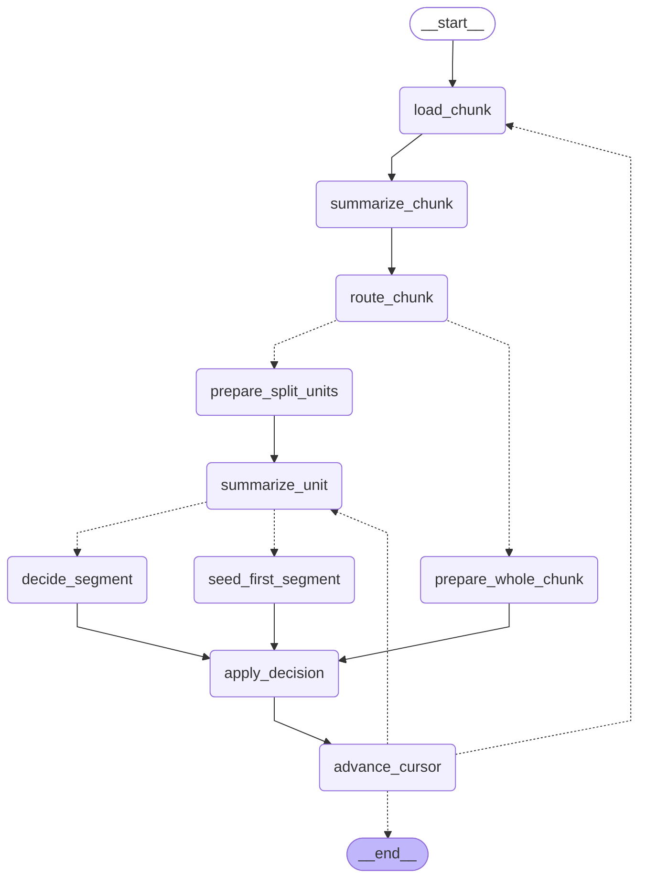
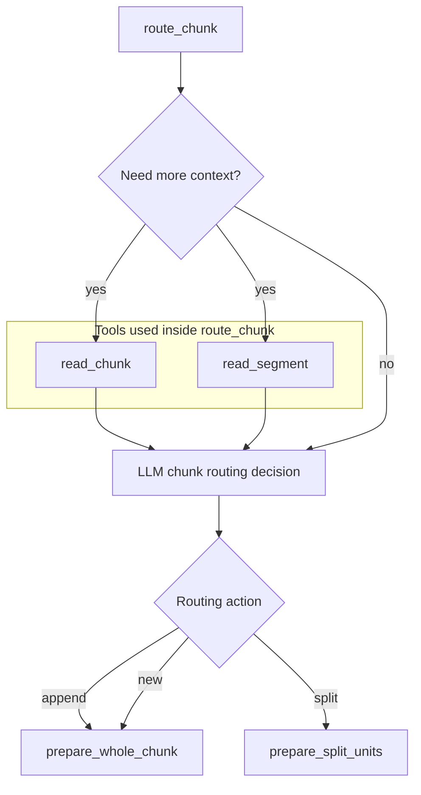
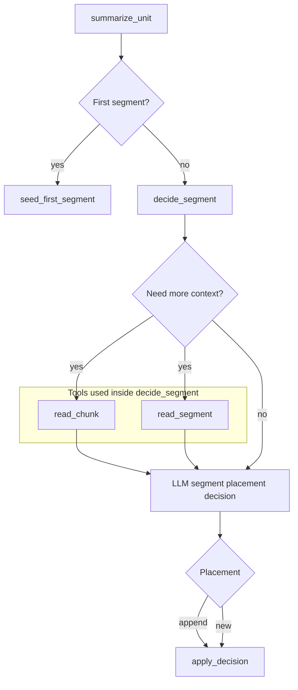

# Segmentation Agent Flow

This document separates:

- the real `LangGraph` structure exported from `create_iterative_segmentation_graph().get_graph()`
- the logical tool subflows that happen inside `route_chunk` and `decide_segment`

## LangGraph Structure



## Logical Tool Subgraph: `route_chunk`

`route_chunk` is a single LangGraph node, but internally it can call tools through the model when deciding:

- `append`
- `new`
- `split`



## Logical Tool Subgraph: `decide_segment`

After a split, each subunit is summarized and then assigned semantically.



## Note

To see the internal tool subgraphs in the rendered graph, export with `xray=1`:

```python
png = graph.get_graph(xray=1).draw_mermaid_png()
```

Without `xray`, LangGraph shows the collapsed top-level workflow and hides the internal subgraph nodes.
